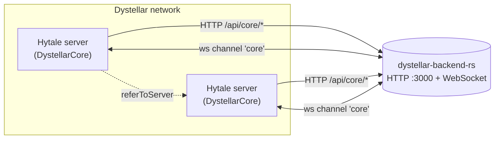
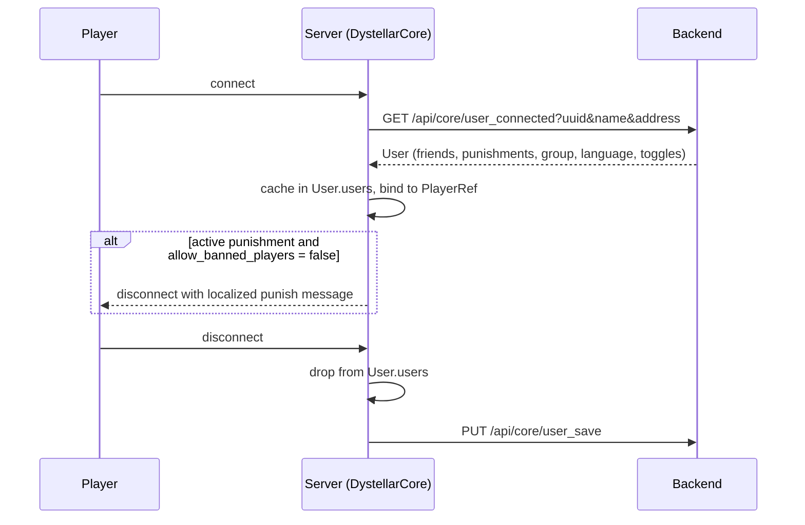

# DystellarCore

**Core plugin for the [Dystellar Network](https://dystellar.gg) Hytale servers.**


DystellarCore is the base mod every Dystellar game server loads. It owns the things that must behave
identically on every server of the network: player data, ranks and permissions, punishments, private
messaging, friends, and the cross-server communication layer that other plugins build on top of.

State does not live on the server — it lives in the Dystellar backend. Servers talk to it over HTTP
for persistence, and over a websocket for real-time messages between each other (targeted, broadcast,
and shared cache).

| | |
| --- | --- |
| Artifact | `gg.dystellar:DystellarCoreHytale:1.0-PRERELEASE` |
| Plugin id | `gg.dystellar_Core` (main class `gg.dystellar.core.DystellarCore`) |
| Backend | [dystellar-backend-rs](https://github.com/TAlgorhythmic/dystellar-backend-rs) — **required**, not optional |
| Toolchain | JDK 25, Maven 3.9+, Git LFS |

---

## Quick start

```sh
git lfs install && git lfs pull   # HytaleServer.jar (~125 MB) lives in LFS
mvn package                       # -> target/DystellarCoreHytale-1.0-PRERELEASE.jar
```

Want a full two-server network with a backend, without touching a real server?

```sh
./setup-docker.sh                 # builds, authenticates, and brings up backend + 2 servers
```

See [Local development environment](#local-development-environment-docker) for what that script does
before you run it — it performs an interactive OAuth device flow the first time.

---

## Table of contents

- [Features](#features)
- [Architecture](#architecture)
- [Requirements](#requirements)
- [Building](#building)
- [Installing on a server](#installing-on-a-server)
- [Configuration](#configuration)
- [Local development environment (Docker)](#local-development-environment-docker)
- [Commands](#commands)
- [Permissions](#permissions)
- [Developer API](#developer-api)
- [Project layout](#project-layout)
- [Tests](#tests)
- [Troubleshooting](#troubleshooting)
- [Known gaps](#known-gaps)
- [Contributing](#contributing)
- [References](#references)
- [License](#license)

---

## Features

| Area | What it does |
| --- | --- |
| **User data** | Loads a `User` from the backend on connect and saves it on disconnect: friends, ignore list, notes, punishments, language, coins, chat/PM toggles, group. |
| **Permissions & groups** | Network-wide groups (ranks) with prefixes, suffixes and permission nodes, fetched from the backend and pushed live to every server. Hooks into Hytale's `PermissionsModule` through a custom `PermissionProvider`. |
| **Punishments** | Ban (optionally IP-wide), mute, blacklist, notes, and unpunish. Punishments carry per-capability flags (chat / ranked / unranked / minigames) and an optional expiry, and are enforced on connect. |
| **Social** | Friend requests (add/accept/reject/remove/list), cross-server friend lookup (`/friend find`), ignore list, private messages with reply, DND and friends-only PM modes. |
| **Chat** | Configurable, colour-tagged message catalogue per language (`en` / `es`), broadcasts, global-chat toggle, and optional rotating automated messages. |
| **Server transfer** | `/join <server>` resolves another server's public address over the websocket channel and refers the player to it. |
| **Moderation utilities** | Freeze (blocks movement via an ECS ticking system), fly for privileged players. |
| **Plugin API** | JSON config helper, HTTP client with token handling, and a websocket channel abstraction other Dystellar plugins can register their own channels on. |

## Architecture



- **HTTP** (`gg.dystellar.core.api.API`) — persistence and queries: `user_connected`, `user_save`,
  `punish`, `unpunish`, `get_groups`, `set_user_group`, `update_group`, … Every request carries the
  `authorization` API key and an `X-Target-Host` header taken from `host` in the config.
- **WebSocket** (`gg.dystellar.core.api.comms.WsClient`) — the backend relays binary frames between
  servers. Plugins register named **channels**; only servers with the same channel name receive a
  message. Message types: `PROPAGATE`, `TARGET`, `CACHE_READ`, `CACHE_WRITE`.
- **Subchannels** (`gg.dystellar.core.messaging.Subchannel`) — DystellarCore's own protocol on top of
  its `core` channel: session replies, player lookup, address requests, friend removal, and group /
  punishment invalidation. The first byte of every payload is the subchannel **ordinal**, so entries
  must only ever be appended to that enum, never reordered.

If the backend is unreachable at startup, config loading fails and the plugin shuts the server down
with `ShutdownReason.CRASH` — the core is a hard dependency, not a best-effort one.

### Player lifecycle



Both sides run off the server thread on `HytaleServer.SCHEDULED_EXECUTOR`, so a slow backend never
blocks the tick loop — but it does mean a player exists on the server for a moment before their data
lands.

## Requirements

- **JDK 25** (`java.version` in `pom.xml`; the code uses unnamed variables `_`).
- **Maven 3.9+**
- **Git LFS** — `libs/HytaleServer.jar` (~125 MB) is tracked through LFS and is a `system`-scoped
  dependency. Without it the build cannot resolve the Hytale API.
- A running [dystellar-backend-rs](https://github.com/TAlgorhythmic/dystellar-backend-rs) instance.
- For the Docker dev environment only: `docker` + `docker compose`, `curl`, `unzip`, `jq`, and a
  Hytale account entitled to run a server.

```sh
git lfs install
git lfs pull
```

## Building

```sh
mvn package
```

Produces a shaded jar at `target/DystellarCoreHytale-1.0-PRERELEASE.jar`. Run tests only with
`mvn test`.

Resource filtering is on, so `${project.version}` is substituted into resources at build time.

## Installing on a server

1. Copy the shaded jar into the server's `mods/` directory (renaming it is fine — the dev environment
   uses `DystellarCore.jar`).
2. Start the server once. The plugin creates its data directory `mods/gg.dystellar_Core/` and writes
   `setup.json`, `lang_en.json` and `lang_es.json` with defaults.
3. Stop the server, point `setup.json` at your backend (`api`, `websocket_endpoint`, `host`,
   `api_key`) and set `server_name` to this server's network-unique name and `public_ip` to the
   address players use to reach it.
4. Start again. On success the log shows `[Dystellar] Configuration loaded successfully`.

## Configuration

### `setup.json`

Generated from `gg.dystellar.core.config.Setup`.

| Key | Default | Meaning |
| --- | --- | --- |
| `debug_mode` | `false` | Verbose behaviour flag. |
| `server_name` | `"lobby"` | **Unique** name of this server on the network. Used as the websocket identity and as the target of `/join` and targeted messages. |
| `scoreboard` | `false` | Scoreboard toggle. |
| `allow_banned_players` | `false` | When `true`, punished players are not disconnected (useful on a punishment-appeal or dev server). |
| `resourcepack` | `false` | Resource pack toggle. |
| `automated_messages` | `false` | Enables the rotating chat announcements. |
| `automated_messages_rate` | `240` | Seconds between announcements. |
| `prevent_weather` | `true` | Forces weather in every world at startup. |
| `forced_weather` | `"Zone1_Sunny"` | Weather asset applied when `prevent_weather` is on. |
| `public_ip` | `"53.63.213.73"` | Address clients use to reach this server; answered to other servers that ask for this server's address, and used by `/join <port>`. The default is a placeholder — **always override it**. |
| `host` | `"localhost"` | Value sent as the `X-Target-Host` header to the backend. |
| `api` | `"http://localhost"` | Backend base URL. |
| `websocket_endpoint` | `"ws://localhost/api/core/create_ws"` | Backend websocket endpoint. |
| `api_key` | `"secretkey"` | Token issued by the backend; sent as `authorization`. |

### `lang_en.json` / `lang_es.json`

Generated from `gg.dystellar.core.config.Messages`. Two things to know:

- **Colour tags** — messages are written as `<ColorName>text`. The palette itself is part of the file
  (`color_declarations`), each entry being a name, a hex colour and optional bold / italic /
  underline / strikethrough flags, so you can add your own named styles.
- **Placeholders** — `{player}`, `{message}`, `{sender}`, `{receiver}`, `{reason}`, `{title}`,
  `{expiration}`, `{seconds}`, `{server}`, `{rank_name}`, `{command}`, … depending on the message.

```json
"msg_receive_format": "<Gray>(From <LightPurple>{sender}<Gray>) <Aqua>{message}"
```

Messages are compiled once at load; a player's `language` field selects the catalogue at runtime
(anything other than `es` falls back to English).

## Local development environment (Docker)

`setup-docker.sh` builds the plugin and brings up a miniature network: one backend and two Hytale
servers, so cross-server features (transfers, friend lookup, group propagation) can actually be
exercised.

```sh
./setup-docker.sh
```

What it does:

1. `mvn package`.
2. Downloads the Hytale downloader and fetches a server release into
   `container_data/hytale-release/release.zip` (skipped if already present).
3. Performs the Hytale OAuth **device flow** — it prints a URL to open in a browser; authorise it
   once and the refresh token is cached in `container_data/hytale-release/refresh_token`. Later runs
   refresh silently.
4. Mints two game sessions (one per server, the second refreshed from the first) and exports them as
   `SESSION_TOKEN`/`IDENTITY_TOKEN` and `SESSION_TOKEN1`/`IDENTITY_TOKEN1`. The current session is
   cached in `container_data/hytale-release/session_token`.
5. Copies the shaded jar to `container_data/hytale-release/DystellarCore.jar`.
6. `docker compose up -d`.

Because the session tokens are exported by the script itself, run **`./setup-docker.sh`** rather than
`docker compose up` directly — a bare compose run would start the servers without credentials.

| Service | Image / source | Port | Notes |
| --- | --- | --- | --- |
| `backend` | Built from `containers/dystellar-backend`; clones and `cargo run --release`s [dystellar-backend-rs](https://github.com/TAlgorhythmic/dystellar-backend-rs) | `3000` (network-internal) | Healthchecked on `/api/signal/status`; both servers wait for it. |
| `server` | `containers/hytale-server` | `5520/udp` | `server_name` = `server`. |
| `server1` | `containers/hytale-server` | `5521/udp` → `5520` | `server_name` = `server1`. |

The server entrypoint unpacks the release, drops the jar into `Server/mods/`, and writes
`Server/mods/gg.dystellar_Core/setup.json` from the compose environment — so `setup.json` is
regenerated on every container start and editing it inside the volume will not survive a restart;
change the entrypoint or the compose environment instead.

Everything is bind-mounted into `container_data/` at the repo root (git-ignored), which is also where
world data and logs end up. Compose must therefore be run from the repository root. The API key is
`testingkey` in this environment — it is a local test credential, not a secret.

Useful:

```sh
docker compose logs -f server     # servers run detached (attach: false)
docker attach server              # interactive console
docker compose down               # stop; keeps container_data
```

## Commands

Registered in `DystellarCore#setup()`. Arguments in `<>` are required, `[]` optional.

### Moderation

| Command | Aliases | Permission | Description |
| --- | --- | --- | --- |
| `/ban <player> <reason> [time] [--ipban]` | — | `dystellar.punish` | Ban a player. `time` matches `^[0-9]+[ydhm]$` (e.g. `30m`, `7d`, `2y`); omit it for permanent. `--ipban` also bans the address. |
| `/mute <player> <reason> <time>` | — | `dystellar.punish` | Mute a player for the given duration (same time format). |
| `/blacklist <player> <reason>` | — | `dystellar.admin` | Permanent, network-wide exclusion. |
| `/unpunish <player> <id>` | — | `dystellar.unpunish` | Revoke a punishment by id (see `/punishments`). |
| `/punishments <player>` | — | `dystellar.punishments` | List a player's punishments with ids, dates and reasons. |
| `/note <player> <note>` | — | `dystellar.notes` | Attach a staff note to a player. |
| `/notes <player>` | — | `dystellar.notes` | List a player's notes. |
| `/freeze <player>` | `ss` | `dystellar.freeze` | Toggle freeze: the player is pinned in place and reminded every 2s. |
| `/broadcast <message>` | `bc` | `dystellar.broadcast` | Broadcast to the server. |
| `/fly [target]` | — | `dystellar.fly`, `dystellar.fly.other` | Toggle flight for yourself, or for someone else with the `.other` node. |

### Permissions administration

`/perms` (alias `/p`) — all subcommands require `dystellar.admin`.

| Subcommand | Description |
| --- | --- |
| `/perms setdefault <group>` | Set the network-wide default group. |
| `/perms setgroup <user> <group>` | Move a user to a group. |
| `/perms listgroups` | List active groups. |
| `/perms copyperms <source> <target>` | Wipe `target`'s permissions, then copy `source`'s. |
| `/perms setall <source> <target>` | Copy `source`'s permissions onto `target` without wiping. |
| `/perms group create <name>` | Create an empty group. |
| `/perms group delete <name>` | Delete a group; its members fall back to the default group. |
| `/perms group listperms <name>` | List a group's nodes. |
| `/perms group setperm <name> <[!]permission>` | Grant a node, or deny it by prefixing `!`. Nodes match `^!?(\w+\.)*(?:\w+\|\*)$`. |
| `/perms group unsetperm <name> <permission>` | Remove a node. |
| `/perms group setprefix <name> <prefix>` | Set the group prefix. |
| `/perms group setsuffix <name> <suffix>` | Set the group suffix. |

Every mutation is written to the backend and then propagated over the websocket, so other servers
refresh the affected group without a restart.

### Social & player

| Command | Aliases | Permission | Description |
| --- | --- | --- | --- |
| `/friend <sub>` | `f` | `dystellar.friend` | Base friends command. |
| `/friend add <target>` | `a` | `dystellar.friend.add` | Send a friend request. |
| `/friend accept <target>` | — | `dystellar.friend.accept` | Accept a pending request. |
| `/friend reject <target>` | — | `dystellar.friend.reject` | Reject a pending request. |
| `/friend remove <target>` | `delete`, `del`, `d`, `rm` | `dystellar.friend.remove` | Remove a friend (the other side is notified across servers). |
| `/friend list` | `l`, `ls` | `dystellar.friend.list` | List your friends. |
| `/friend find <target>` | `f`, `locate` | `dystellar.friend.find` | Find which server a friend is on. |
| `/friend toggle` | — | `dystellar.friend.toggle` | Toggle incoming friend requests. |
| `/message <target> <message>` | `msg`, `tell` | `dystellar.message` | Send a private message. |
| `/reply <message>` | `r` | `dystellar.message` | Reply to the last person who messaged you. |
| `/ignore <target>` | `noreply`, `dismiss`, `snub`, `nopm` | `dystellar.ignore` | Block a player. |
| `/ignorelist [list\|remove <player>]` | `blockslist` (`l`/`ls`, `rm`/`del`/`d`) | `dystellar.ignore` | Manage blocked players. |
| `/toggleprivatemessages` | `togglemessages`, `tpms`, `tpm`, `pms` | `dystellar.togglemessages` | Cycle PM mode: all → friends only → disabled. |
| `/toggleglobalchat` | `tgc`, `togglechat` | `dystellar.togglechat` | Toggle global chat visibility. |
| `/join <server>` | `j` | `dystellar.referral` | Connect to another server. Accepts a network name (resolved over the websocket), `ip`, `ip:port`, or a bare port (uses this server's `public_ip`). Plain `ip` defaults to port `5520`. |
| `/suffix` | `suffixs`, `suffixes` | `dystellar.suffix` | Cosmetic suffix UI — **not implemented yet**. |

## Permissions

Nodes are resolved through `CustomPermProvider`, which merges the player's own nodes with their
group's (personal nodes win). A node stored with value `false` is exposed to Hytale as `-node`, i.e. an
explicit deny. Groups are the only writable path — attempts to mutate permissions through Hytale's
provider API are rejected and logged.

Node families in use:

```
dystellar.admin                 dystellar.punish        dystellar.punishments
dystellar.unpunish              dystellar.notes         dystellar.freeze
dystellar.broadcast             dystellar.fly[.other]   dystellar.referral
dystellar.message               dystellar.ignore        dystellar.togglechat
dystellar.togglemessages        dystellar.suffix.*      dystellar.friend[.add|.remove|
                                                        .accept|.reject|.list|.find|.toggle]
```

## Developer API

Full guides live in [`docs/`](docs):

- [`docs/API_DOC.md`](docs/API_DOC.md) — HTTP requests and the websocket channel protocol.
- [`docs/CONFIG_DOC.md`](docs/CONFIG_DOC.md) — the generic JSON config helper.

Quick tour:

```java
// HTTP — token and headers are handled for you
var api = DystellarCore.getApi();
var res = api.getJson("/players/stats");
var out = api.requestJson("/players/update", "POST", "{\"score\": 42}");

// Websocket — register your own channel; only servers running your plugin see it
Channel ch = DystellarCore.getApi().wsClient.registerChannel("MyPlugin",
    (source, in)  -> { /* incoming message */ },
    (cacheId, found, in) -> { /* cache read response */ });

// Broadcast to every other server running this plugin
var msg = ch.createPropagatedMessageStream(128);
msg.writePrefixedUTF8("Steve");
msg.writeInt(0);
ch.sendMessage(msg.getBuffer());

// Or target one server by its `server_name`
var direct = ch.createTargetedMessageStream("server1", 256);

// Shared cache: write with an expiry in millis (-1 = never expires), then read it back
var cache = ch.createCacheWriteMessageStream(256, 42, 30_000L);
ch.readCacheRequest(42);
```

```java
// Typed JSON config, defaults come from the no-args constructor
Config<MyConfig> config = new Config<>(pluginInstance, "myconfig.json", MyConfig.class);
config.load();          // creates the file with defaults if missing
config.get().someField = "value";
config.save();
```

`ByteBufferOutputStream` writes and `ByteBufferInputStream` reads must be symmetric — the protocol is
raw binary with no framing beyond the length prefix on strings. Handlers run off the server thread —
treat them as asynchronous and do not assume thread safety.

## Project layout

```
src/main/java/gg/dystellar/core/
├── DystellarCore.java        plugin entry point, config + command registration
├── api/
│   ├── API.java              HTTP client and backend endpoints
│   ├── Config.java           generic Gson-backed config
│   └── comms/                WsClient, Channel, Receiver, MessageType
├── commands/                 every registered command
├── common/                   User, Suffix, punishments
├── config/                   Setup (setup.json), Messages (lang_*.json)
├── listeners/                JoinsListener (load/save user, enforce punishments)
├── messaging/                Subchannel enum + Handler callbacks
├── perms/                    Group, Permission, CustomPermProvider
├── serialization/            Protocol DTOs, inventory/location serialization
└── utils/                    Pair, Triple, Result, helpers
containers/                   Dockerfiles + entrypoints for the dev environment
docs/                         API and config guides
libs/HytaleServer.jar         Hytale server API (Git LFS)
setup-docker.sh               one-shot dev environment bootstrap
```

## Tests

```sh
mvn test
```

JUnit 5 covers message compilation (colour tags, placeholders, formatting) and permission resolution.

## Troubleshooting

| Symptom | Cause / fix |
| --- | --- |
| Build fails resolving `com.hypixel.hytale:server` | `libs/HytaleServer.jar` is an LFS pointer, not the jar. Run `git lfs install && git lfs pull`. |
| `invalid source release: 25` | Maven is running on an older JDK. Point `JAVA_HOME` at a JDK 25 install. |
| Server shuts down at startup with `[Dystellar] Failed to load core plugin` | The backend is unreachable or `api_key` is wrong. The core treats the backend as a hard dependency; check `api`, `websocket_endpoint`, `host` and `api_key` in `setup.json`. |
| Servers start but never see each other | Duplicate or mismatched `server_name`. It is the websocket identity, and must be unique per server on the network. |
| `/join <name>` says "Server not found" | The target server is not connected to the same backend websocket, or its `public_ip` is unset. |
| Docker servers start unauthenticated | `docker compose up` was run directly. Session tokens are exported by `setup-docker.sh` — run that instead. |
| Edits to `setup.json` inside a container are lost | The entrypoint rewrites it from the compose environment on every start. Change `docker-compose.yml` or the entrypoint. |

## Known gaps

- `/suffix` responds "Not implemented yet"; `Suffix` is still a hardcoded enum using legacy `&` colour
  codes and should move to the backend.
- Inbox support is stubbed out — see the `TODO` blocks in `messaging/Handler.java` and
  `listeners/JoinsListener.java`, plus the commented-out `INBOX_*` subchannels.
- Friend request accept/reject buttons wait on clickable-message support in the Hytale API.
- [`docs/API_DOC.md`](docs/API_DOC.md) has drifted from the code in two places: `CacheReadReceiver`
  takes `(cacheId, found, payload)` — there is no `source` parameter — and cache expiry is a plain
  `long expirationMillis`, not an `Optional` (the two-argument
  `createCacheWriteMessageStream(capacity, cacheId)` passes `-1`).
- `src/main/resources/plugin.yml`, `lang-en.yml` and `spawnitems.yml` are leftovers from the Bukkit
  version of this plugin. The live manifest is `src/main/resources/manifest.json`, and the live
  language files are the generated `lang_en.json` / `lang_es.json`.
- `manifest.json` hardcodes `"Version": "1.0.0"` while the Maven project is `1.0-PRERELEASE`; the two
  drift apart on every release until the manifest is filtered like `plugin.yml` was.

## Contributing

The license permits contributions back to this repository but not independent forks — see below.
In practice:

- Work from a branch in this repository, or send patches; do not publish a derivative repo.
- `mvn test` must pass. New message keys need a matching entry in **both** `lang_en` and `lang_es`
  defaults in `config/Messages.java`.
- Never reorder `Subchannel` entries — the wire protocol identifies messages by enum ordinal, and a
  reorder silently breaks every server still running the old build. Append only.
- New commands go in `commands/`, get registered in `DystellarCore#setup()`, and should declare a
  `dystellar.*` permission node.

## References

- Example plugin template: <https://github.com/Hytale-Modding/example-plugin-template>
- Community API docs: <https://hytale-docs.com/docs/api/overview>
- Backend: <https://github.com/TAlgorhythmic/dystellar-backend-rs>
- Website: <https://dystellar.gg>

## License

Copyright © 2025 Dystellar Network. All rights reserved. Released under the **Organization-Exclusive
License** — see [`LICENSE`](LICENSE) for the full text. In short:

- You may view, compile, run and modify the Software for personal or educational use, and contribute
  improvements back via pull requests or patches.
- You may **not** fork, clone or create derivative repositories on any platform without written
  permission from the copyright holder.
- You may **not** use it commercially outside Dystellar Network or its authorized affiliates, and may
  **not** redistribute, sublicense or share it or derivative works except as contributions to this
  repository.

Permission requests: <support@dystellar.gg>

---

Maintained by Algorhythmic for the Dystellar Network.
